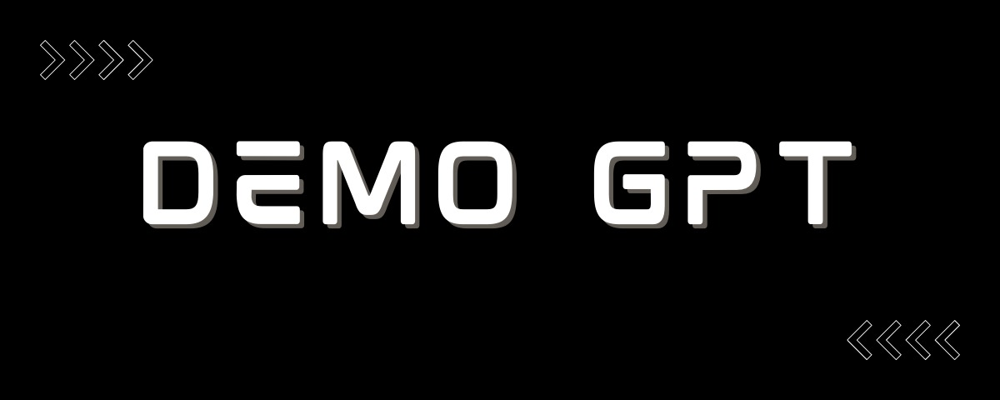

# DemoGPT



## Demo

https://github.com/melih-unsal/DemoGPT/assets/34304254/728545ba-860b-47c9-b9e9-1a51ab9f3647

## Table of Contents

- [Introduction](#introduction)
- [Pipeline](#pipeline)
- [Installation](#installation)
- [Usage](#usage)
- [Contribute](#contribute)
- [License](#license)

## Introduction

DemoGPT is an innovative open-source project designed to streamline the development of Language Learning Model (LLM) based applications. It leverages the capabilities of GPT-3.5-turbo to auto-generate LangChain code using a 'Tree of Thoughts' (ToT) approach. LangChain is traditionally used for creating pipelines for LLM-based applications, and with DemoGPT, we are transforming the way we handle these pipelines. 

The process is fully automated, with DemoGPT generating code, running tests, and progressively developing the project step by step. Each piece of code is tested and evaluated by itself. If it passes the auto-generated tests, the development proceeds, allowing for efficient and error-free development.

## Pipeline
### DemoGPT Sequence Diagram


## Installation

To get started with DemoGPT, you'll first need to clone the repository:
```
git clone https://github.com/melih-unsal/DemoGPT.git
```

Next, navigate to the project directory:
```
cd DemoGPT
```

Then, install the necessary dependencies. 
```
pip install -r requirements.txt
```

## Usage

To use DemoGPT, you can run the command below:

```
cs src/prompt_based
streamlit run app.py
```

## Contribute

Contributions to the DemoGPT project are welcomed! Whether you're fixing bugs, improving the documentation, or proposing new features, your efforts are highly appreciated. Please check the open issues before starting any work.

> Please read [`CONTRIBUTING`](CONTRIBUTING.md) for details on our [`CODE OF CONDUCT`](CODE_OF_CONDUCT.md), and the process for submitting pull requests to us.

## License

DemoGPT is an open-source project licensed under [MIT License](LICENSE).

---

For any issues, questions, or comments, please feel free to contact us or open an issue. We appreciate your feedback to make DemoGPT better.
